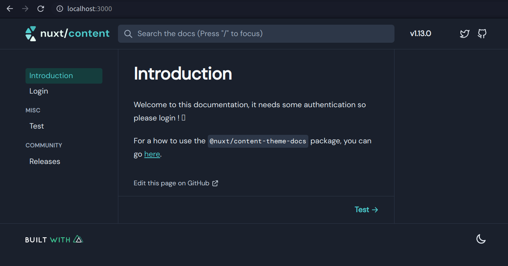
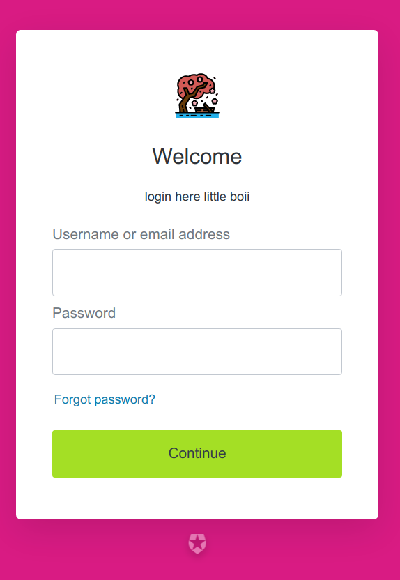
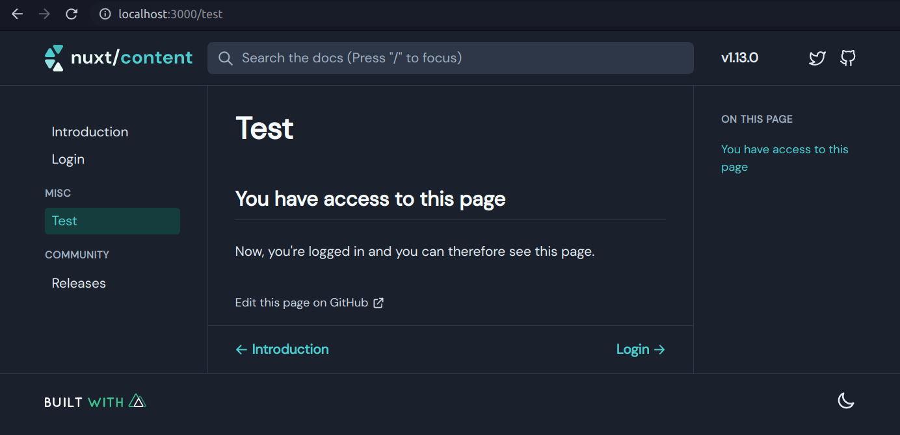

Related to this SO question: https://stackoverflow.com/questions/66366486/how-to-add-authentication-in-nuxt-js-content-docs-theme

This is an example on how to make an authenticated [`@nuxt/docs-theme`](https://content.nuxtjs.org/themes/docs/) documentation project thanks to Auth0. The project is an SPA to disallow a non-JS access to the documentation.

## Configuration
The requirements are to:
- setup the whole Auth0 configuration
  - go to `Applications` sidebar section
  - create a native app (application type), then go to the `Settings` tab
  - fill in the domain, let's say `dope-asdasd.auth0.com` (can be basically whatever before `auth0`)
  - get your client ID key
  - for allowed `callback URLs`, `Allowed Logout URLs`, `Allowed Web Origins`, `Allowed Origins (CORS)`
  you can basically set `http://localhost:3000, https://documentation.dope-website.com`
- go to `Connections > Database` sidebar section and enable `Username-Password-Authentication`
  - Requires Username > `true`
  - Disable Sign Ups > `true`
  - Enable your app in the `Applications` tab
- Go to `Users & Roles > Users` sidebar section
  - Create a user there and validate it's email
- go back to `Applications > your-app-name`, `Connections` tab and double check that `Username-Password-Authentication` is enabled
- follow this configuration section: https://auth.nuxtjs.org/providers/auth0/#pkce-grant-flow
- fill in the `AUTH0_DOMAIN` and `AUTH0_CLIENT_ID` env variables (used in `nuxt.config.js`) into Netlify or any static provider (`.env` file for local debugging)

Then, you should have access to it locally and on any static hosting solution. Working great so far and cannot be accessed by disabling the JS, good solution for a secure private documentation.

## Screenshots
Here is how it looks after the local server is running (`npm run dev`).

You cannot access the `misc > test` doc page, you will be redirected to the `Login` one automatically until you do have the JWT Auth0 token. The latter is given by entering the credentials set in the Auth0 `Users` configuration page.

Once you have everything set up, you will be able to access the secure `Test` page.

---
PS: once authenticated, I'm not sure how to clear it. Auth0 seems to have some kind of verification even if you clear your cookies. But if you try it in another browser or in a private window, you will see that you'll need auth so it's working great on this point.
